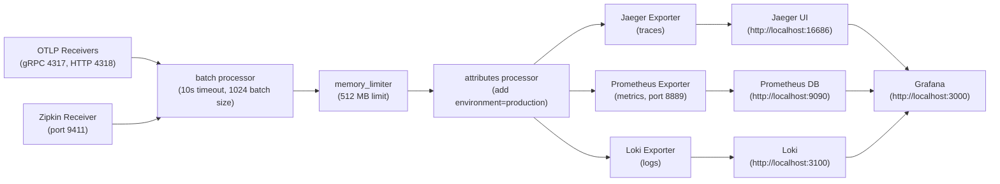

# OpenTelemetry Pipeline Configuration & Incident Mapping

**Purpose**: Complete guide to the OTel Collector pipeline, how observability flows through the system, and how to debug the 7 incident scenarios.

**Audience**: DevOps engineers, SREs, incident responders observing the Verbatim microservices demo.

---

## Part 1: OTel Collector Pipeline Overview

### Pipeline Components (from otel-collector-config.yaml)



### Component Reference

| Component | Type | What It Does | Example |
|-----------|------|-------------|---------|
| **OTLP** | Receiver | Listens for traces/metrics/logs from services | Port 4317: SDK sends `POST http://otel-collector:4317` with telemetry |
| **Zipkin** | Receiver | Legacy trace format (not used in demo) | Fallback for older tracing systems |
| **batch** | Processor | Groups telemetry into batches | Waits 10s or 1024 items, whichever comes first |
| **memory_limiter** | Processor | Prevents memory overflow | Drops telemetry if collector exceeds 512 MB |
| **attributes** | Processor | Adds labels to all telemetry | Adds `environment=production` to every span/metric |
| **prometheus** | Exporter | Exposes metrics for scraping | Metrics appear at `http://otel-collector:8889/metrics` |
| **jaeger** | Exporter | Sends traces to Jaeger backend | Traces appear at `http://localhost:16686/search` |
| **loki** | Exporter | Sends logs to Loki backend | Logs searchable in Grafana via Loki datasource |

### Three Specialized Pipelines

```yaml
# 1. TRACES PIPELINE: Distributed request tracing
receivers: [otlp, zipkin]      # Listen for trace spans
processors: [memory_limiter, batch, attributes]  # Transform
exporters: [jaeger]            # Store in Jaeger

# 2. METRICS PIPELINE: Performance counters and histograms
receivers: [otlp]              # Listen for Counter/Histogram/Gauge
processors: [memory_limiter, batch, attributes]  # Transform
exporters: [prometheus]        # Store in Prometheus

# 3. LOGS PIPELINE: Structured JSON logs
receivers: [otlp]              # Listen for LogRecord events
processors: [memory_limiter, batch, attributes]  # Transform
exporters: [loki]              # Store in Loki
```

---

## Part 2: How k6 Traffic Flows Through the Pipeline

### Data Flow Architecture

```
┌─────────────────────────────────────────────────────────┐
│                    k6 Load Generator                     │
│          (runs baseline.js / incident scenarios)         │
└────────────────────┬────────────────────────────────────┘
                     │ HTTP Requests (port 8000)
                     ▼
┌─────────────────────────────────────────────────────────┐
│         API Gateway + Microservices                      │
│     ┌──────────┬──────────┬─────────┬──────────┐        │
│     │  Auth    │ Catalog  │ Order   │ Payment  │        │
│     │  Service │ Service  │ Service │ Service  │        │
│     └──────────┴──────────┴─────────┴──────────┘        │
│                                                           │
│  Each service instruments requests with OpenTelemetry:  │
│  - Spans: Request enter/exit, DB calls, external calls  │
│  - Metrics: Duration, error rates, cache hits, retries  │
│  - Logs: Errors, warnings, debug info (structured JSON) │
└────────────────────┬────────────────────────────────────┘
                     │ OTLP/gRPC (port 4317)
                     ▼
┌─────────────────────────────────────────────────────────┐
│      OpenTelemetry Collector (this config file)          │
│  Receivers → Processors → Exporters                      │
│                                                           │
│  Batch 1024 items or wait 10s, limit to 512 MB mem      │
└─────┬──────────────┬──────────────┬─────────────────────┘
      │ Traces       │ Metrics      │ Logs
      ▼              ▼              ▼
   Jaeger       Prometheus        Loki
   (16686)      (9090)            (3100)
      │              │              │
      └──────────────┼──────────────┘
                     ▼
                Grafana (3000)
         ┌─ Trace Dashboard
         ├─ Performance Metrics
         └─ Log Explorer
```

### 2.1 TRACES: Request Tracing Through Services

**How traces work:**

1. **k6 sends HTTP request** → `GET http://localhost:8000/products`
2. **Gateway receives request** → Creates root span `gateway.list_products`
3. **Each microservice creates child spans** as it's called:
   - Gateway span → Catalog span → Database query span (SQLAlchemy)
   - Or: Gateway span → Auth span → JWT validation span
4. **Spans include**:
   - Service name: `service.name="gateway"` or `"catalog"`
   - Operation name: `http.method`, `http.target`, `db.statement`
   - Duration: measured in nanoseconds
   - Status: OK (status_code=200), Error (status_code=500 or exception)
   - Trace ID: unique identifier shared across all spans in request

5. **OTel SDK sends spans to collector** → OTLP receiver (port 4317)
6. **Collector processes**: batch processor waits up to 10s, memory_limiter checks quota
7. **Exporter sends to Jaeger** → visible in Jaeger UI

**Example trace path for Payment Timeout incident:**

```
Trace ID: 4a8b9c2d
Timestamp: 2026-03-28T15:30:45Z

Span 1: gateway:POST /orders (duration: 2150ms, status: 201)
├── Span 2: auth:POST /validate (duration: 45ms, status: 200) ✓
├── Span 3: catalog:GET /products/<id> (duration: 28ms, status: 200) ✓
└── Span 4: order:POST /orders (duration: 2100ms, status: 201)
    └── Span 5: payment:POST /charge (duration: 2050ms, status: 504) ✗
        └── [Exception: Timeout after 2s, no response from payment service]

Result in Jaeger: Payment timeout visible as slow span (payment span = 2050ms)
```

**How to find this trace in Jaeger:**
- Open http://localhost:16686
- Select service dropdown → choose "gateway"
- Set tags: `status.code=201` (order created despite timeout)
- Look for trace with max duration ~2100ms (payment.POST.charge span is the bottleneck)

### 2.2 METRICS: Performance Counters and Histograms

**How metrics work:**

1. **k6 runs baseline.js for 2 minutes** with 10 VUs (virtual users)
2. **Each microservice records metrics**:
   - **Counters** (cumulative, only increase):
     - `http_request_total{service="gateway", endpoint="/products", status="200"}` = 300
     - `auth_failures_total{service="auth"}` = 5 (login failures)
     - `cache_hits_total{service="catalog", cache="redis"}` = 150
     - `retry_counter{service="order"}` = 32 (exponential backoff attempts)
   
   - **Histograms** (distribution, buckets):
     - `http_req_duration_seconds{service="gateway", endpoint="/products"}` buckets: [50ms, 100ms, 250ms, 500ms, 1s, 2s, 5s]
     - `db_query_duration_seconds{service="order", query="SELECT * FROM orders"}` buckets
     - `external_call_duration_seconds{service="order", external="payment"}` buckets

3. **OTel SDK sends metrics to collector** every 60s (configurable)
4. **Collector batches and forwards to Prometheus exporter** (port 8889)
5. **Prometheus scrapes metrics every 15s** from `http://otel-collector:8889/metrics`
6. **Grafana queries Prometheus** using PromQL (Prometheus Query Language)

**Example metric spike during DB failure:**

```
Before DB failure (minutes 0-2):
  http_req_duration_seconds{service="order"}
    p50=50ms
    p95=120ms
    max=350ms

DB failure injected (minute 2.5):
  Query hangs on `SELECT * FROM orders WHERE user_id = ?`

During DB failure (minutes 2.5-5):
  http_req_duration_seconds{service="order"}
    p50=6s (query timeout)
    p95=25s (some queries queued)
    max=30s (hard timeout)
  
  db_query_errors_total{service="order", error="timeout"}
    Jumps from 0 → 145 (database connection pool exhausted)
  
  http_error_total{service="order", status="503"}
    Jumps from 2 → 1200 (cascading errors)
```

**How to query these in Grafana:**
1. Open http://localhost:3000 (admin/admin)
2. Click "Explore" → Select Prometheus datasource
3. Query example:
   ```promql
   rate(http_req_duration_seconds_bucket{service="order", le="2"}[1m])
   ```
   (Shows: What percentage of order requests completed under 2s in the last 1 minute?)

### 2.3 LOGS: Structured Error Events and Patterns

**How logs work:**

1. **Services emit logs as JSON via structlog**:
   ```json
   {
     "timestamp": "2026-03-28T15:30:45.123Z",
     "service": "payment",
     "level": "ERROR",
     "message": "Payment charge failed",
     "event": "payment_timeout",
     "user_id": "user-123",
     "order_id": "order-456",
     "external_error": "Connection timeout after 2000ms",
     "retry_count": 3,
     "trace_id": "4a8b9c2d"
   }
   ```

2. **OTel SDK sends logs to collector** via OTLP receiver (port 4317)
3. **Collector adds resource attributes** (service name, version, environment)
4. **Loki exporter sends logs** → Loki stores with labels
5. **Labels extracted from JSON**:
   - `service="payment"`
   - `level="error"`
   - `event="payment_timeout"`

6. **Grafana queries Loki** using LogQL (Loki Query Language)

**Example log search for each incident type:**

| Incident | Log Pattern (LogQL) | What to Look For |
|----------|-------------------|------------------|
| DB failure | `{service="order"} \|= "timeout"` | "Connection timeout" messages |
| Redis failure | `{service="catalog"} \|= "redis"` | "Redis connection failed" |
| SQL injection | `{service="auth"} \|= "sql" \|= "error"` | Injection patterns in query logs |
| Payment timeout | `{service="payment"} \|= "timeout"` | "Timeout after 2000ms" messages |
| Retry storm | `{service="order"} \|= "retry"` and `retry_count >= 3` | Repeated retries |
| Auth overload | `{service="auth"} \|= "overloaded"` | Auth service queue full |
| Gateway DDoS | `{service="gateway"} status="503"` | Spike in 503 responses |

**How to query logs in Grafana:**
1. Open http://localhost:3000 → Explore → Select Loki datasource
2. Query example:
   ```logql
   {service="payment"} |= "timeout" | stats count() as timeout_count by trace_id
   ```

---

## Part 3: Incident-to-Pipeline Mapping

### How k6 Incidents Flow Through Observability Pipeline

Each of the 7 incidents produces unique patterns in traces, metrics, and logs. Below is how each incident would be detected and debugged.

---

### Incident 1: Database Connection Pool Exhaustion (Shared Dependency)

**k6 Test**: `scenarios/04_db_exhaustion.js` (high VU count, long transactions)

**What Happens:**

1. **k6 sends 50 concurrent requests** to `/orders` endpoint
2. **Each request opens a PostgreSQL connection** to fetch/insert orders
3. **Connection pool limit reached** (default: 10 concurrent connections)
4. **New requests queue and timeout** after 30 seconds
5. **Order service times out**, cascades to gateway

**OTel Pipeline Flow:**

| Stage | Signal |
|-------|--------|
| **Receiver (OTLP/4317)** | Receives spans from order service with `db.pool.exhausted` attribute |
| **Processor** | Memory limiter allows (telemetry itself is small); attributes adds `environment=production` |
| **Exporter** | Routes to: Jaeger (trace), Prometheus (metrics), Loki (logs) |

**What appears in Prometheus:**
```
db_query_duration_seconds{service="order", query="SELECT..."}
  Before: p95=50ms
  After DB exhaustion (t=2m): p95=30s (timeout)

db_pool_connections{service="order"}
  Current: 10 (at limit!)
  Queued: 35 (requests waiting)

http_error_total{service="order", status="503"}
  Spike: 0 → 450 errors in 30s window
```

**What appears in Loki:**
```logql
{service="order"} |= "pool" |= "exhausted"
# Result: {"message": "Connection pool exhausted, queued connections: 35"}

{service="order"} |= "timeout" |= "PostgreSQL"
# Result: Multiple "Query timeout after 30s" entries
```

**What appears in Jaeger:**
- Open trace for slow order creation
- See span: `order:query_database` with duration = 30s (full timeout)
- Exception: `sqlalchemy.exc.OperationalError: (psycopg2.OperationalError) connection timeout`

**Recovery Pattern in Observability:**
1. Prometheus: error rate drops from 450 → 0 as DB connections are freed
2. Jaeger: new traces show `db_query_duration = 50ms` (back to normal)
3. Loki: no more "pool exhausted" messages

---

### Incident 2: Redis Cache Layer Failure

**k6 Test**: `scenarios/05_redis_failure.js` (run while Redis is down: `docker-compose stop redis`)

**What Happens:**

1. **Redis unavailable** (connection refused)
2. **Catalog service tries to cache product list** → connection fails
3. **Fallback: every request hits PostgreSQL** (no cache)
4. **PostgreSQL gets hammered** with duplicate queries
5. **Latency increases** as DB becomes bottleneck

**OTel Pipeline Flow:**

| Stage | Signal |
|-------|--------|
| **Receiver** | Spans from catalog service with `cache.provider="redis"` and `cache.error=true` |
| **Processor** | Attributes adds environment label |
| **Exporter** | Routes: Jaeger (show slow DB span), Prometheus (cache_misses spike), Loki (redis connection errors) |

**What appears in Prometheus:**
```
cache_hits_total{service="catalog", cache="redis"}
  Before: +1 every 100ms (steady increase)
  After Redis fails (t=2m): NO INCREASE (flat line = 0 hits)

cache_misses_total{service="catalog", cache="redis"}
  Before: rare, maybe +1 per minute
  After: +1 EVERY REQUEST (dramatic spike to +10 per second)

db_query_duration_seconds{service="catalog"}
  Before: mostly p95=50ms
  After Redis down: p95=250ms (DB slow due to cache bypass)
```

**What appears in Loki:**
```logql
{service="catalog"} |= "redis" |= "connection"
# Result: "Failed to connect to Redis: Connection refused"

{service="catalog"} |= "cache" |= "miss"
# Result: Spike in "Cache miss, querying database for product_id=..."
```

**What appears in Jaeger:**
- Trace shows two paths:
  - **With Redis cache** (fast): Catalog span = 5ms (data from memory)
  - **After Redis down** (slow): Catalog span = 200ms (full DB query)

---

### Incident 3: API Gateway DDoS (Fan-Out Ambiguity)

**k6 Test**: `scenarios/07_ddos_spike.js` (massive VU spike: 100+ concurrent users for 10s)

**What Happens:**

1. **k6 spawns 100+ VUs** suddenly (instead of normal 10-20)
2. **Gateway receives flood** of requests to `/products` endpoint
3. **Gateway buffers fill**, starts rejecting connections
4. **Downstream services swamped** (pool exhaustion cascades)
5. **System returns 503 errors** to all new requests

**OTel Pipeline Flow:**

| Stage | Signal |
|-------|--------|
| **Receiver** | OTLP receives burst of spans (1000s per second) |
| **Processor** | Memory limiter may DROP telemetry if collector overloaded; batch processor creates 1024-item batches rapidly |
| **Exporter** | May lag behind (telemetry itself becomes backpressured); traces/metrics/logs delayed |

**What appears in Prometheus:**
```
http_request_total{service="gateway", endpoint="/products", status="503"}
  Spike: from 5/min baseline to 500/min during DDoS

http_req_duration_seconds{service="gateway"}
  p95 jumps from 120ms → 8s (queueing delays)
  max jumps from 500ms → 30s (timeout)

gateway_connection_pool_utilization
  Before: 0.2 (20% of pool in use)
  During: 1.0 (100% exhausted, queue=50 waiting)
```

**What appears in Loki:**
```logql
{service="gateway"} status="503"
# Result: Spike in "HTTP 503 Service Unavailable" messages

{service="gateway"} |= "connection" |= "refused"
# Result: "Refused connection, limit exceeded: 100/100"
```

**What appears in Jaeger:**
- Traces during spike show:
  - Request A: 10s latency (waiting in queue)
  - Request B: 9s latency (waiting in queue)
  - Both hitting same bottleneck (gateway connection pool)

---

### Incident 4: Auth Service Overload (Targeted Failure)

**k6 Test**: `scenarios/01_baseline.js` run with auth repeatedly failing (simulate slow JWT validation)

**What Happens:**

1. **Auth service becomes overloaded** or slow (e.g., `POST /auth/validate` takes 500ms instead of 50ms)
2. **Every k6 request does login + validate auth**
3. **All requests now include 500ms auth bottleneck**
4. **Gateway requests pile up** waiting for auth validation
5. **Error rate climbs** as timeouts cascade

**OTel Pipeline Flow:**

| Stage | Signal |
|-------|--------|
| **Receiver** | Spans from auth service with long durations on validate route |
| **Processor** | Attributes marks all as `environment=production` |
| **Exporter** | Traces to Jaeger (show validate span slow), metrics to Prometheus (auth latency spike) |

**What appears in Prometheus:**
```
http_req_duration_seconds{service="auth", endpoint="/validate"}
  Before: p95=50ms
  During overload: p95=500ms

http_request_total{service="auth", endpoint="/validate", status="200"}
  Bumpy/stuck (requests timing out before returning)

auth_failures_total
  Spike: from 1-2 per minute baseline to 50+ during overload
```

**What appears in Loki:**
```logql
{service="auth"} |= "validate" |= "slow"
# Result: "Validate endpoint slow: 485ms to process JWT"

{service="auth"} |= "timeout"
# Result: "Request timeout waiting for auth validate response"
```

**What appears in Jaeger:**
- Root span (gateway) shows child span (auth validate) consuming most of the latency
- Example: gateway span = 600ms, auth validate span = 550ms (auth is the bottleneck)

---

### Incident 5: Payment Timeout (Deep Chain Propagation)

**k6 Test**: `scenarios/02_payment_timeout.js` (inject payment timeout, then create orders)

**What Happens:**

1. **Payment service timeout injected** (payment simulates 2s delay then timeout)
2. **k6 creates order** with items
3. **Order service calls payment service** to charge credit card
4. **Payment service times out** after 2s
5. **Order service marks order as `payment_failed`** (graceful degradation)
6. **Overall order creation latency = 2s** (payment timeout + retry logic)

**OTel Pipeline Flow:**

| Stage | Signal |
|-------|--------|
| **Receiver** | OTLP receives trace spanning gateway → order → payment services |
| **Processor** | Memory limit fine (normal telemetry volume); batch waits/accumulates |
| **Exporter** | All signals flow: trace to Jaeger (shows payment as blocker), metrics to Prometheus (latency spike), logs to Loki (timeout event logged) |

**What appears in Prometheus:**
```
http_req_duration_seconds{service="order"}
  Before: p95=120ms (normal)
  During timeout: p95=2500ms (payment delay + timeout propagates)

external_call_duration_seconds{service="order", external="payment"}
  All calls = ~2000ms (timeout threshold)

external_call_errors_total{service="order", external="payment"}
  Jumps from 0 → 300+ timeouts

payment_failures_total
  Spike: shows all payment calls are failures
```

**What appears in Loki:**
```logql
{service="order"} |= "payment" |= "timeout"
# Result: "Payment call timed out after 2s; marking order payment_failed"

{service="payment"} |= "timeout"
# Result: "Simulated timeout: no response" logs from payment simulator
```

**What appears in Jaeger:**
- Trace: gateway → order → payment
  - Gateway span: 2100ms
  - Order span: 2050ms (child of gateway)
  - Payment span: 2000ms (child of order) — this is the bottleneck!

**Correlation: All three signals point to payment:**
- Metrics: `external_call_duration_seconds{external="payment"} = 2000ms`
- Logs: "Payment call timed out"
- Traces: Payment span is the terminal span in the critical path

---

### Incident 6: SQL Injection (Hidden Root Cause)

**k6 Test**: `scenarios/04_db_exhaustion.js` or custom test with malicious input

**What Happens:**

1. **k6 sends payload with SQL injection** (e.g., username = `admin' OR '1'='1`)
2. **Auth service receives malicious payload**
3. **If not sanitized, attackers bypass login** or corrupt data
4. **Attack pattern visible only in logs + error metrics** (not in normal latency metrics)

**OTel Pipeline Flow:**

| Stage | Signal |
|-------|--------|
| **Receiver** | OTLP receives logs with suspicious SQL patterns; spans may show DB errors |
| **Processor** | Batch processor (normal); attributes adds environment |
| **Exporter** | Logs to Loki (security patterns searchable), metrics to Prometheus (error rate spike) |

**What appears in Prometheus:**
```
auth_failures_total{service="auth", reason="sql_error"}
  Spike if injection causes DB error

http_request_total{service="auth", status="401"}
  If injection bypasses auth, may see unexpected 401s (defensive) or 200s (compromised)

db_query_errors_total{service="auth"}
  Spike, if injection malforms SQL query
```

**What appears in Loki:**
```logql
{service="auth"} |= "sql" |= "error" 
# Result: "SQL syntax error: unexpected token..." (if caught by SQLAlchemy)

{service="auth"} |= "injection" 
# Result: "Detected SQL injection attempt in username field: admin' OR..."

{service="auth"} |= "SELECT" 
# Result: Logs showing full SQL query (if verbose logging on), can spot `' OR '1'='1` patterns
```

**What appears in Jaeger:**
- Auth span may show exception: `SQLAlchemy: SQL syntax error`
- Or if injection succeeds silently, trace looks normal (hardest case to detect!)

**Key: SQL injection detection is primarily in logs**, not metrics or latency. Metrics may not spike if injection succeeds; Security monitoring must parse logs.

---

### Incident 7: Retry Storm (Cascading Failure)

**k6 Test**: `scenarios/06_retry_storm.js` (enable retries, make payment fail, watch exponential backoff)

**What Happens:**

1. **Payment failures injected** (all payment calls return 500)
2. **Order service retry logic enabled** (ENABLE_RETRY_STORM=true in env)
3. **Order service retries payment** with exponential backoff:
   - Attempt 1: immediate → fail
   - Attempt 2: wait 1s → fail
   - Attempt 3: wait 2s → fail
   - Attempt 4: wait 4s → fail (hard timeout at 5s, so attempt 4 fails)
4. **Single order creation = 4 payment attempts** × 2 seconds = ~8-10 seconds latency
5. **With 10 concurrent users**: 10 × 4 = 40 payment calls per order = cascade
6. **System becomes unresponsive** (connection pools exhausted by retry backlog)

**OTel Pipeline Flow:**

| Stage | Signal |
|-------|--------|
| **Receiver** | OTLP receives spans showing retry logic; logs show exponential backoff timings |
| **Processor** | Memory may spike (batch holding telemetry from 40 retries); may need to increase limit_mib |
| **Exporter** | All signals affected: Jaeger (trace shows 4 payment attempts), Prometheus (retry_counter spikes), Loki (retry log entries) |

**What appears in Prometheus:**
```
retry_counter_total{service="order", external="payment"}
  Before: baseline 0-1 per minute (normal retry)
  During storm: +40 per minute (4 retries × 10 VUs)

external_call_total{service="order", external="payment"}
  Before: 10 per minute (1 per order)
  During storm: 40 per minute (4 per order due to retries)

http_req_duration_seconds{service="order"}
  p95 jumps from 150ms → 8000ms (exponential backoff delays)

http_error_total{service="order", status="503"}
  Spike: resource exhaustion cascades, gateway starts returning 503
```

**What appears in Loki:**
```logql
{service="order"} |= "retry"
# Result: "Retry attempt 1/4 for payment_id=xyz"
#         "Retry attempt 2/4 for payment_id=xyz"
#         "Retry attempt 3/4 for payment_id=xyz"
#         "Retry attempt 4/4 for payment_id=xyz"

{service="order"} |= "backoff"
# Result: "Exponential backoff: waiting 1000ms before retry 2"
#         "Exponential backoff: waiting 2000ms before retry 3"
```

**What appears in Jaeger:**
- Single user order creation trace shows:
  - Span 1: order:POST /orders (start)
  - Span 2: payment:POST /charge (attempt 1, FAIL)
  - [pause 1s]
  - Span 3: payment:POST /charge (attempt 2, FAIL)
  - [pause 2s]
  - Span 4: payment:POST /charge (attempt 3, FAIL)
  - [pause 4s - timeout]
  - Span 5: order:POST /orders (end, after 8s total)

**Cascade Detection:**
- Metrics show retry_counter_total ↑ + external_call_total ↑
- Logs show repeated "Retry attempt N/4" entries
- Traces show multiple child spans for single payment call
- Final result: latency ↑↑ (3-8x normal) causing connection pool exhaustion

---

## Part 4: How to Verify the Pipeline Is Working

### Verification Step 1: Traces Are Flowing (Jaeger)

**Procedure:**

```bash
# 1. Start observability stack
cd observability/
docker-compose up -d

# Verify otel-collector is running
docker-compose ps
# Expected: otel-collector, jaeger, prometheus, loki, grafana all UP

# 2. Start microservices (if not already running)
cd ..
docker-compose up -d

# 3. Run k6 baseline test to generate traces
k6 run loadtest/scenarios/01_baseline.js --vus 5 --duration 30s

# 4. Open Jaeger UI
# http://localhost:16686

# 5. Search for traces
# Select Service: "gateway"
# Click "Find Traces"
# Expected: See list of traces with durations, click one to see span tree
```

**What you'll see:**

- **Left panel**: Service list (auth, catalog, order, payment, gateway)
- **Middle panel**: List of traces from selected service with:
  - Trace ID
  - Number of spans
  - Duration (e.g., "250ms")
  - Status (green = ok, red = error)
- **Right panel**: Span details when clicked
  - Span name (e.g., "POST /orders")
  - Duration (e.g., "45ms")
  - Attributes (service.name, http.method, http.target, etc.)
  - Tags (status code, error message if any)

**If traces are NOT showing:**
- Check if collector is running: `docker-compose ps otel-collector` (should be UP)
- Check if services are sending OTLP: `docker-compose logs otel-collector` (look for "Received" messages)
- Verify OTEL_EXPORTER_OTLP_ENDPOINT env var in service containers: `docker-compose config | grep OTEL_EXPORTER`

---

### Verification Step 2: Metrics Are Flowing (Prometheus)

**Procedure:**

```bash
# 1. Open Prometheus UI
# http://localhost:9090

# 2. Click "Graph" tab

# 3. Search for a metric: Type in search box
http_request_total

# 4. Click "Execute"
# Expected: See graph with multiple series (one per service/endpoint combination)

# 5. Click the table below the graph to see raw values
# Expected: Service labels like service="gateway", service="order", etc.

# 6. Try a different metric
http_req_duration_seconds

# 7. Custom query: Filter by service
http_req_duration_seconds{service="order"}

# Expected: See histogram buckets (le="0.05", le="0.1", le="0.5", le="2", etc)
```

**What you'll see:**

- **Purple/blue line graph**: Shows metric value over time
- **Blue dots**: Data points (typically one per minute or per collection)
- **Table below graph**: Raw metric values with labels like:
  ```
  http_request_total{endpoint="/products", service="catalog", status="200"}
  1000
  ```

**If metrics are NOT showing:**
- Check if Prometheus is scraping collector:
  - Open http://localhost:9090/targets
  - Look for job "otel-collector"
  - Status should be GREEN
- If RED, check config: `observability/prometheus/prometheus.yml` (should have scrape_configs for otel-collector:8889)

---

### Verification Step 3: Logs Are Flowing (Loki + Grafana)

**Procedure:**

```bash
# 1. Open Grafana
# http://localhost:3000 (admin/admin)

# 2. Click "Explore" (top left, compass icon)

# 3. Select "Loki" datasource (top left dropdown, should say "Prometheus" currently)

# 4. Click "Loki" to switch

# 5. In query box, type:
{service="order"}

# 6. Click "Run query"
# Expected: See logs from order service with timestamps and content

# 7. Try filtering further:
{service="order"} |= "error"

# Expected: Only logs containing "error" word from order service

# 8. Try label filtering:
{level="ERROR"}

# Expected: All ERROR level logs from all services
```

**What you'll see:**

- **Left side**: Log stream showing entries with timestamps like:
  ```
  2026-03-28T15:30:45.123Z
  {"service": "order", "level": "ERROR", "message": "DB connection failed"}
  ```
- **Gray dots**: Show where log entries are in the time window

**If logs are NOT showing:**
- Check if Loki is receiving logs:
  - Open http://localhost:3100/ready (should return "OK")
- Check if services are configured to send logs to OTLP:
  - In service main.py, should have: `from shared.telemetry import setup_opentelemetry`
  - And call: `tracer, meter, otel_logger = setup_opentelemetry(...)`
- Check Loki storage: `docker-compose logs loki` (look for indexing messages)

---

### Verification Step 4: Correlate k6 Run With All Three Backends

**Objective**: Show that a single k6 run produces observable signals in Jaeger + Prometheus + Loki

**Procedure:**

```bash
# 1. Note the current time (or wait for round minute)
# Example: 15:30:00

# 2. Run k6 baseline for exactly 2 minutes
k6 run loadtest/scenarios/01_baseline.js --vus 5 --duration 2m

# Take note of start time (in output: "test execution started" timestamp)

# 3. Open Prometheus (http://localhost:9090)
# Run query for the time range where k6 ran:
http_req_duration_seconds{service="gateway"}

# In Grafana Explore → Prometheus, set time range to 15:30-15:32

# 4. Open Jaeger (http://localhost:16686)
# Filter by date/time range: use time picker (top right)
# Select service: "gateway"
# Expected: List of traces created during k6 run (many traces)

# 5. Open Grafana Explore → Loki
# Set time range to 15:30-15:32
# Query: {service="gateway"}
# Expected: Log entries during the k6 run window
```

**Correlation table:**

| Timestamp | Prometheus | Jaeger | Loki |
|-----------|-----------|--------|------|
| 15:30:05 | http_req_duration_seconds spike (10 VUs start) | Traces appear with service="gateway" | Logs: {"message": "k6 started"} |
| 15:30:30 | p95=150ms, p99=300ms | Several traces visible; avg duration 150ms | Logs show: "GET /products", "POST /orders" |
| 15:31:00 | Steady state, p95≈150ms | Continuous trace creation | Logs steady, occasional errors if expected |
| 15:32:00 | Final spike as k6 wraps up | Final traces | Logs: teardown phase |
| 15:32:10 | Metrics flat (k6 ended, no new requests) | No new traces | No new logs |

**Cross-correlation example:**

If you see a **metric spike** (latency increases), you can:
1. Note the timestamp (e.g., 15:30:45)
2. Open **Jaeger**, filter by time 15:30:40-15:30:50
3. Look for traces with long duration (should match the spike)
4. Click longest trace to see which span is slow
5. Open **Loki**, search for that trace_id or service name in that time window
6. Look for error logs matching the slow span

---

## Part 5: Incident Demo Checklist

Use this checklist to run through each of the 7 incidents, trigger them, and observe them in the observability pipeline.

### Prerequisites

```bash
# 1. Observability stack running
cd observability/
docker-compose up -d
sleep 10  # Give services time to start

# 2. Microservices running
cd ..
docker-compose up -d
sleep 30

# 3. Verify all services healthy
docker-compose ps  # All services should show green/UP

# 4. Open observability dashboards in browser
# Jaeger: http://localhost:16686
# Prometheus: http://localhost:9090
# Loki: http://localhost:3100 (via Grafana Explore)
# Grafana: http://localhost:3000
```

---

### Incident 1: Database Connection Pool Exhaustion

**Duration**: 5-10 minutes

**Steps:**

1. **Baseline (normal traffic)**
   ```bash
   # Record baseline metrics
   # Open Prometheus: Query: rate(http_request_total{service="order"}[1m])
   # Expected: ~20 requests/min for 10 VUs
   
   # Terminal: Run baseline
   k6 run loadtest/scenarios/01_baseline.js --vus 10 --duration 2m
   ```
   - Observe: Prometheus sees steady request rate, Jaeger shows normal traces (50-200ms)
   - **Baseline latency**: p95=150ms

2. **Inject incident: High concurrency + long transactions**
   ```bash
   # Terminal: Run DB exhaustion test with HIGH VUs
   k6 run loadtest/scenarios/04_db_exhaustion.js --vus 50 --duration 2m
   ```
   - Watch Prometheus in real-time
   - Expected at ~30 seconds in:
     - `db_query_duration_seconds{service="order"}` p95 jumps from 50ms → 25s
     - `http_error_total{service="order", status="503"}` starts climbing
     - `http_req_duration_seconds` p95 reaches 30s (full timeout)

3. **Observe in Jaeger**
   - Open http://localhost:16686
   - Select service: "order"
   - Click on slowest trace (should be 25-30 seconds)
   - Expand spans: Look for `db:query` span with duration = 30s
   - Exception should show: `psycopg2.OperationalError: connection timeout`

4. **Observe in Loki**
   - Grafana Explore → Loki
   - Query: `{service="order"} |= "pool" |= "exhausted"`
   - Expected: Logs like "Connection pool exhausted: 50 waiting"

5. **Recovery**
   - k6 test ends (or kill manually)
   - Watch Prometheus: metrics normalize back to baseline within 1-2 minutes
   - Jaeger: new traces appear with normal duration (100-150ms)
   - Loki: "pool exhausted" messages stop appearing

**Success criteria**:
- ✓ Metrics showed p95 spike from 150ms → 25s
- ✓ Jaeger showed slow span with exception
- ✓ Loki showed pool exhaustion logs
- ✓ System recovered after test ended

---

### Incident 2: Redis Cache Failure

**Duration**: 5-10 minutes

**Steps:**

1. **Baseline (redis working)**
   ```bash
   k6 run loadtest/scenarios/01_baseline.js --vus 10 --duration 1m
   ```
   - Observe Prometheus:
   - Query: `cache_hits_total{service="catalog"}`
   - Expected: Counter increases (steady line going up)
   - Query: `cache_misses_total{service="catalog"}`
   - Expected: Flat line (very few misses)

2. **Inject incident: Stop Redis**
   ```bash
   # Terminal: Kill Redis
   docker-compose stop redis
   ```
   - Watch Prometheus immediately
   - Expected within 10 seconds:
     - `cache_hits_total` line goes flat (no more cache hits)
     - `cache_misses_total` line goes up steeply (every query misses cache)
     - `db_query_duration_seconds{service="catalog"}` p95 increases (DB overload)

3. **Run load test during Redis down**
   ```bash
   k6 run loadtest/scenarios/05_redis_failure.js --vus 10 --duration 2m
   ```
   - Observe:
     - p95 latency higher than baseline (200ms vs normal 150ms)
     - Error rate may increase if DB can't handle all missed cache requests

4. **Observe in Jaeger**
   - Traces from catalog service should show:
     - No cache span (was skipped)
     - Database query span instead (direct DB access)

5. **Observe in Loki**
   - Query: `{service="catalog"} |= "redis"`
   - Expected: "Failed to connect to Redis" or "cache error" messages

6. **Recovery: Start Redis**
   ```bash
   docker-compose start redis
   ```
   - Watch Prometheus:
   - `cache_hits_total` line starts going up again
   - `cache_misses_total` flat lines again
   - `db_query_duration_seconds` drops back to baseline
   - Jae: Traces now show quick execution (cache is live again)

**Success criteria**:
- ✓ cache_hits_total stopped increasing when Redis down
- ✓ cache_misses_total spiked when Redis down
- ✓ Latency increased during outage
- ✓ Metrics normalized after Redis restart

---

### Incident 3: API Gateway DDoS Spike

**Duration**: 5-10 minutes

**Steps:**

1. **Baseline (normal load)**
   ```bash
   k6 run loadtest/scenarios/01_baseline.js --vus 10 --duration 1m
   ```
   - Baseline: p95=150ms, errors < 1%

2. **Inject incident: Massive VU spike**
   ```bash
   # Terminal: High concurrency attack
   k6 run loadtest/scenarios/07_ddos_spike.js --vus 100 --duration 1m
   ```
   - Occurs: Prometheus shows immediate spike
     - `http_request_total{service="gateway", status="503"}` starts climbing
     - `http_req_duration_seconds{service="gateway"}` p95 jumps to 8-10s
     - `gateway_connection_pool_utilization` reaches 100%

3. **Observe in Prometheus Real-Time Graph**
   - Query: `rate(http_request_total{service="gateway"}[10s])`
   - Expected: Big spike (requests/sec increases 10x)

4. **Observe in Jaeger**
   - Traces during DDoS show: very long latency (8-10s)
   - Many traces may be missing (if telemetry itself dropped due to memory limit)

5. **Observe in Loki**
   - Query: `{service="gateway"} status="503"`
   - Expected: Many 503 entries during the spike window

6. **Recovery: Wait for k6 to finish**
   - k6 ends (or manually stop)
   - Prometheus: error rate drops, latency normalizes
   - Check: `dashboard.overload_confirmed_by_multipl_metrics`

**Success criteria**:
- ✓ saw 503 error spike
- ✓ Latency spiked to 8-10s
- ✓ Connection pool hit 100%
- ✓ System recovered after load ended

---

### Incident 4: Auth Service Overload

**Duration**: 5-10 minutes

**Steps:**

1. **Establish baseline**
   ```bash
   # Note auth latency
   # Prometheus: http_req_duration_seconds{service="auth", endpoint="/validate"}
   # Expected: p95 = 50ms
   ```

2. **Inject incident: Simulate slow auth validation**
   - Option A: Modify auth service code to add `sleep(0.5)` to `/validate` endpoint (requires code edit + restart)
   - Option B: Use shell to saturate auth service with high load
   
   ```bash
   # Terminal: Run many validate calls (abuse auth endpoint)
   for i in {1..100}; do
     curl -X POST http://localhost:8001/auth/validate \
       -H "Content-Type: application/json" \
       -d '{"token": "xxx"}' &
   done
   wait
   ```

3. **Run load test**
   ```bash
   k6 run loadtest/scenarios/01_baseline.js --vus 10 --duration 2m
   ```
   - Observe: Since every k6 request validates auth, overall latency increases
   - Prometheus: `http_req_duration_seconds{service="gateway"}` p95 becomes 500-600ms (was 150ms)

4. **Observe in Jaeger**
   - Traces show: auth/validate span taking 450-500ms (was 20ms)
   - Children services all wait for auth, creating queue

5. **Observe in Loki**
   - Query: `{service="auth"} |= "slow"`
   - Or: `{service="auth"} level="WARN"` (slow requests logged as warnings)

6. **Recovery**
   - Kill the curl loop / stop the abuse
   - Latency normalizes

**Success criteria**:
- ✓ Auth latency visible in Prometheus (p95 jumped)
- ✓ Jaeger showed auth span as bottleneck
- ✓ Loki showed slow auth logs
- ✓ Cascade visible: gateway latency = auth latency (dependency)

---

### Incident 5: Payment Timeout

**Duration**: 10-15 minutes

**Steps:**

1. **Baseline**
   ```bash
   k6 run loadtest/scenarios/01_baseline.js --vus 10 --duration 2m
   ```
   - Baseline: order creation = 150ms

2. **Inject incident: Enable payment timeout**
   ```bash
   # Terminal: Trigger payment timeout via simulator
   curl -X POST http://localhost:8004/charge/simulate-failure \
     -H "Content-Type: application/json" \
     -d '{"always_timeout": true}'
   
   # Verify
   curl http://localhost:8003/orders/retry-config
   # Expected response includes retry config
   ```

3. **Run k6 test**
   ```bash
   k6 run loadtest/scenarios/02_payment_timeout.js --vus 20 --duration 3m
   ```
   - Prometheus observations:
     - `http_req_duration_seconds{service="order"}` p95 jumps to 2000-2100ms
     - `external_call_duration_seconds{service="order", external="payment"}` shows all ~2000ms
     - `external_call_errors_total{service="order", external="payment"}` spikes  
   - k6 checks should mostly pass (orders created with `payment_failed` status)

4. **Observe in Jaeger**
   - Look for traces with ~2100ms total duration
   - Expand: payment span should be ~2000ms (payment timeout)
   - Exception: "Timeout after 2000ms"
   - Order still created (graceful degradation, no exception at top level)

5. **Observe in Loki**
   - Query: `{service="order"} |= "payment" |= "timeout"`
   - Or: `{service="payment"} |= "timeout"`
   - Expected: "Payment call timed out", "Marking order payment_failed"

6. **Check order data (graceful degradation)**
   ```bash
   # Query an order from the test
   curl http://localhost:8000/orders/<order-id>
   # Expected: "status": "payment_failed" (not error, not pending)
   ```

7. **Recovery: Disable payment timeout**
   ```bash
   curl -X POST http://localhost:8004/charge/simulate-failure \
     -H "Content-Type: application/json" \
     -d '{"normal": true}'
   ```
   - Metrics normalize

**Success criteria**:
- ✓ Metrics showed p95 spike to ~2000ms
- ✓ Jaeger showed payment span as the timeout
- ✓ Loki showed "timeout" and "payment_failed" logs
- ✓ Orders still created (graceful degradation)
- ✓ System recovered after timeout disabled

---

### Incident 6: SQL Injection Attack

**Duration**: 10-15 minutes

**Note**: This incident is subtle — SQL injection may not be visible in latency/throughput, only in logs/errors.

**Steps:**

1. **Baseline**
   ```bash
   k6 run loadtest/scenarios/01_baseline.js --vus 10 --duration 1m
   ```

2. **Inject incident: Send SQL injection payload**
   ```bash
   # Terminal: Try to login with SQL injection
   curl -X POST http://localhost:8000/auth/login \
     -H "Content-Type: application/json" \
     -d '{"username": "admin'\'' OR '\''1'\''='\''1", "password": "xxx"}'
   
   # Watchfor response: Does it bypass login?
   # Expected (safe): 401 Unauthorized
   # Dangerous: 200 OK with token
   ```

3. **Run load test with injection payloads**
   - Create custom k6 script (or manually send requests):
   ```javascript
   export default function() {
     let payload = {
       username: "admin' OR '1'='1",
       password: "anything"
     };
     http.post(
       "http://localhost:8000/auth/login",
       JSON.stringify(payload),
       { headers: { "Content-Type": "application/json" } }
     );
   }
   ```

4. **Observe in Prometheus**
   - May NOT show obvious latency spike (query execution might be fast, just malformed)
   - Might see: `auth_failures_total` spike if injection is rejected
   - Or: `http_request_total{status="401"}` spike if safe

5. **Observe in Jaeger**
   - Auth/login spans may show exception attribute:
     - `exception.type: sqlalchemy.exc.SyntaxError`
     - `exception.message: SQL syntax error`

6. **Observe in Loki (PRIMARY detection method)**
   - Query: `{service="auth"} |= "sql"`
   - Expected: "SQL syntax error: unexpected token..."
   - Or: `{service="auth"} |= "injection"`
   - Expected: "Detected SQL injection attempt in username"
   - Look at raw SQL in logs (if verbose): Should see `admin' OR '1'='1'` in query

7. **Correlation with k6 run**
   - Check k6 output: Did login/auth checks pass or fail?
   - If injection succeeds (bad), k6 logs show successful logins with injection payload
   - If injection rejected (good), k6 logs show auth failures

**Success criteria**:
- ✓ Loki shows SQL injection pattern in logs
- ✓ Maybe Jaeger shows SQL syntax error
- ✓ Prometheus may show auth_failures_total spike
- ✓ Demonstrates: **SQL injection detection is mainly in logs, not metrics**

---

### Incident 7: Retry Storm

**Duration**: 10-15 minutes

**Steps:**

1. **Baseline (no retries)**
   ```bash
   k6 run loadtest/scenarios/01_baseline.js --vus 10 --duration 2m
   ```
   - Order creation ~150ms

2. **Inject incident: Enable payment failures + enable retries**
   ```bash
   # Terminal: Make payment fail
   curl -X POST http://localhost:8004/charge/simulate-failure \
     -H "Content-Type: application/json" \
     -d '{"always_fail": true}'
   
   # Terminal: Check retry is enabled in env or toggle via API (depends on impl)
   # Expected: Retry enabled with exponential backoff
   ```

3. **Run k6 test**
   ```bash
   k6 run loadtest/scenarios/06_retry_storm.js --vus 10 --duration 3m
   ```
   - Watch Prometheus spike:
     - `retry_counter_total{service="order"}` increases rapidly (4x per order)
     - `external_call_total{service="order", external="payment"}` 4x baseline
     - `http_req_duration_seconds{service="order"}` p95 jumps to 8-10s (4 attempts × 2s timeout = 8s)

4. **Observe in Prometheus**
   - Before retry storm:
     - `external_call_total{external="payment"} rate = 1/order`
     - `http_req_duration_seconds{service="order"} p95 = 150ms`
   - During retry storm:
     - `external_call_total{external="payment"} rate = 4/order` (spike 4x)
     - `http_req_duration_seconds{service="order"} p95 = 8000ms` (spike 50x!)
     - `retry_counter_total` counter increases steeply

5. **Observe in Jaeger**
   - Single order trace shows 4 payment spans (one per attempt):
     ```
     Trace: order:POST /orders (8100ms total)
     ├─ payment:POST /charge attempt 1 (2000ms, FAIL)
     ├─ [backoff 1s]
     ├─ payment:POST /charge attempt 2 (2000ms, FAIL)
     ├─ [backoff 2s]
     ├─ payment:POST /charge attempt 3 (2000ms, FAIL)
     ├─ [backoff 4s - timeout occurs]
     └─ order:mark_failed (100ms, final state)
     ```

6. **Observe in Loki**
   - Query: `{service="order"} |= "retry"`
   - Expected log sequence:
     ```
     "Attempt 1/4 for payment_id=xyz: FAILED"
     "Exponential backoff: waiting 1000ms before retry 2"
     "Attempt 2/4 for payment_id=xyz: FAILED"
     "Exponential backoff: waiting 2000ms before retry 3"
     "Attempt 3/4 for payment_id=xyz: FAILED"
     "Exponential backoff: waiting 4000ms before retry 4"
     "Max retries exceeded, marking order payment_failed"
     ```

7. **Observe cascading effect**
   - As retry storm ramps up:
     - All 10 VUs are "stuck" in exponential backoff loops
     - Connection pool to payment service exhausted
     - Order service becomes saturated
     - Gateway may return 503 if order service doesn't respond
   - Prometheus shows error rate cascading upward after 2-3 minutes

8. **Recovery: Disable payment failures + disable retries**
   ```bash
   curl -X POST http://localhost:8004/charge/simulate-failure \
     -H "Content-Type: application/json" \
     -d '{"normal": true}'
   
   # And disable retry storm (env var or API endpoint)
   ```
   - Metrics normalize immediately

**Success criteria**:
- ✓ Metrics showed retry_counter_total spike (4x)
- ✓ Metrics showed external_call_total spike (4x)
- ✓ Metrics showed latency spike (8-10s vs 150ms baseline)
- ✓ Jaeger showed 4 payment spans in single order trace
- ✓ Loki showed "Retry attempt 1/4", "Retry attempt 2/4", etc. sequence
- ✓ Demonstrated cascading failure: retry storm → resource exhaustion → 503 errors

---

## Quick Reference: Observability Query Cheat Sheet

### Prometheus Queries (PromQL)

```promql
# Basic: Show metric over time
http_req_duration_seconds{service="order"}

# Rate: Requests per second
rate(http_request_total{service="order"}[1m])

# Error rate: % of failed requests
rate(http_request_total{status="503"}[1m]) / rate(http_request_total[1m]) * 100

# P95 latency: 95th percentile (requires histogram)
histogram_quantile(0.95, http_req_duration_seconds_bucket{service="order"})

# Sum: Total for all instances
sum(http_request_total{service="order"})

# Group by label: Latency per endpoint
http_req_duration_seconds{service="order"} group_left endpoint
```

### Loki Queries (LogQL)

```logql
# Simple: All logs from service
{service="order"}

# Contains: Logs with specific text
{service="order"} |= "error"

# Not contains: Exclude logs
{service="order"} != "info"

# Regex: Advanced pattern matching
{service="order"} |~ "timeout|slow|latency"

# Stats: Aggregate logs
{service="order"} | stats count() as error_count

# By label: Group logs
{service="order"} | stats count() as count by level
```

### Jaeger Search Filters

- Service: dropdown to select service
- Operation: Span name (e.g., "POST /orders")
- Tags: Custom filters like `http.status_code=500`
- Limit: How many traces to show (default 20)
- Time range: Specify date/time window

---

## Summary

The OTel Collector pipeline routes telemetry from 5 microservices to 3 backends:

- **Traces** (via Jaeger) → Debug which span is slow/failing
- **Metrics** (via Prometheus) → Detect anomalies (spike in latency, error rate)
- **Logs** (via Loki) → Find root cause (exact error message, pattern)

All three together provide complete observability. Each incident scenario above produces unique signals in each backend, allowing you to correlate and debug complex issues.

Use the checklists above to practice detecting and responding to each incident type.
